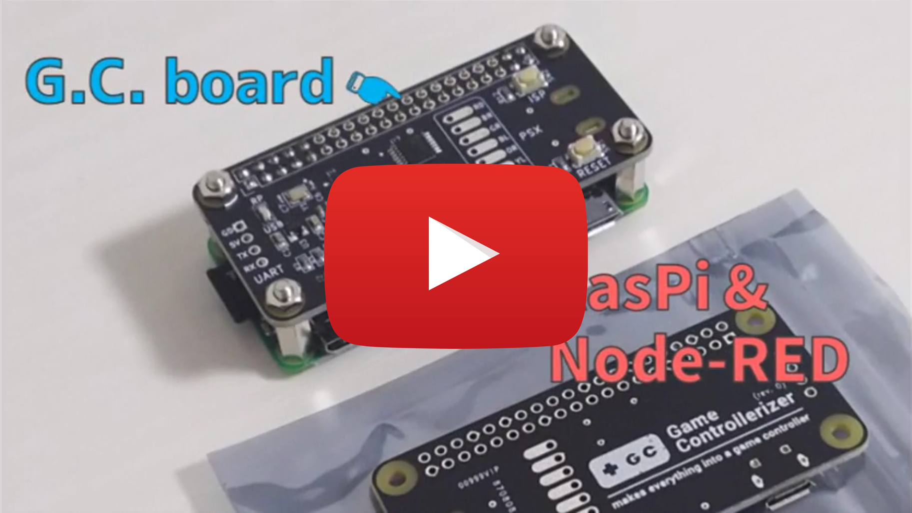
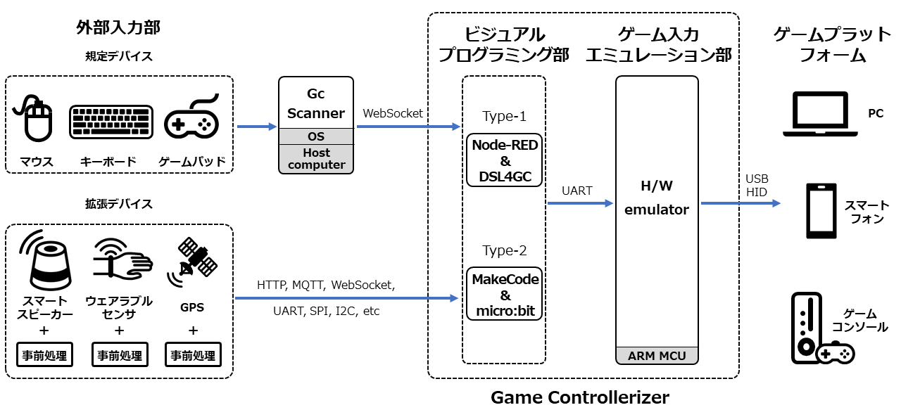

# Game Controllerizer : Developers site

Game Controllerizer はディジタルゲーム拡張のためのミドルウェアです．多様な機器および情報源を既存ゲームへの入力として扱えるようにすることで，新たなエンタテインメントの創出やゲーミフィケーションの構成のための試行錯誤を容易に行うことを可能とし，もって当該分野の研究・教育活動推進に寄与することを目的としています．

ミドルウェアの開発は，[津田塾大学・栗原一貴](http://www.unryu.org/)先生を中心としたチームでおこなっています．詳しくは[論文](https://arxiv.org/abs/1810.01070)を参照ください

また，初めての方は [Starers site](https://sites.google.com/view/gamecontrollerizer) も併せて参照ください．

## 応用例
  
※津田塾大学栗原研究室の研究事例紹介

## 構成概要
Game Controllerizer は，様々な既存ディジタルゲームプラットフォームへの入力をソフトェア（S/W）またはハードウェア（H/W）によりエミュレートするゲーム入力エミュレーション部，およびエンドユーザプログラマが多様な機器および情報源と通信しながら最終的にゲーム入力エミュレーション部へと操作入力を送信する手順を記述するビジュアルプログラミング部からなります．  
ビジュアルプログラミング部については
- [Node-RED](https://nodered.org/) : エミュレータを RasPi や PC といった Linux 環境から制御するため
- [Makecode](https://makecode.microbit.org/) : エミュレータを micro:bit から制御する場合

の2環境を設けており，利用目的や得意分野に合わせて選択可能です．

また，ディジタルゲームへの入力信号の時系列情報を一次元の文字列として記述する可読性の高い簡易言語である [DSL4GC](https://github.com/GameControllerizer/DSL4GC)（Domain Specific Language for Game Control）を用意しており，Node-RED環境で利用可能です．

## 各部説明
### Node-RED
エミュレータを RasPi や PC といった Linux 環境から制御する場合に利用可能です．ゲーム制御情報を Node-RED のカスタムノード，もしくは DSL4GC で記述・編集することができます．IoT / HTTP / WebSocket といった分野を得意にする方にお勧めします．詳しくは[こちら](https://github.com/GameControllerizer/node-red-contrib-game_controllerizer).

### Makecode
エミュレータを micro:bit から制御する場合に利用可能です．ゲーム制御情報を Scratch スタイルのプログラミングブロック，もしくは Javascript で記述・編集することができます．マイコン / 電子工作といった分野を得意にする方にお勧めします．詳しくは[こちら](https://github.com/GameControllerizer/pxt-gamecontrollerizer).

### S/W Emulator（更新停止中）
各ゲームプラットフォームに対する入力を電子的に模擬するS/Wです．詳しくは[こちら](https://github.com/GameControllerizer/GcSwEmulator)．  
現時点での対応プラットフォームは以下です．

- PC(Mouse)
- PC(Keyboard)

### H/W Emulator
各ゲームプラットフォームに対する入力を電子的に模擬するH/Wです．対象プラットフォームに接続すると，USB HID互換ゲームパッドとして振舞います．詳しくは[こちら](https://github.com/GameControllerizer/GcHwEmulator)．  
現時点での対応プラットフォームは以下です．

- PC(Gamepad)
- Game console(Gamepad) * _USB互換ゲームパッドを接続可能な機種に限る_
- PC / Smartphone / Game console(Mouse) * _discontinued_
- PC / Smartphone / Game console(Keyboard) * _discontinued_

### DSL4GC
ディジタルゲームへの入力信号を抽象化し,簡便に表現するための固有言語（Domain Specific Language for Game Control）です． JSON で記述できます．言語仕様については[こちら](https://github.com/GameControllerizer/DSL4GC)．

### GcScanner
一般的な USB Gamepad / Mouse / Keyboard の入力信号を DSL4GC 形式の JSON に変換するプログラムです．HTML+Javascript で書かれておりブラウザ上で動作します．詳しくは[こちら](https://github.com/GameControllerizer/GcScannerJs)．

## プログラミングインタフェース
より柔軟な制御を行いたい場合，GUI（e.g. Makecode, Node-RED）に頼らないプログラミングインタフェースも利用することもできます．
将来的には拡充する予定です（e.g. python Android, iOS）．
- [GcOpsJs](https://github.com/GameControllerizer/GcOpsJs) : node.js むけ
- [GcOpsObniz](https://github.com/GameControllerizer/GcOpsObniz) : obniz むけ

## 関連ソフトウェア（外部リンク）
GameControllerizer を使っての開発を進める際に便利なソフトウェアの紹介です．

- [Xbox 360 Controller Emulator](https://www.x360ce.com/)(Win) : GC-H/W Emulator や一般的なゲームパッドの入力を確認するのに適しています．
- [HTML5 Gamepad Tester](https://html5gamepad.com/)(Win/Mac/Linux) : 同じくGC-H/W Emulator や一般的なゲームパッドの入力を確認するのに適しています．Gamepad API の仕様のため十字キーが認識されなかったり，ブラウザより挙動が異なります． 
- [JoyToKey](https://joytokey.net/ja/)(Win) : ジョイスティックの入力をキーボード/マウス入力へと変換します．
- [Enjoyable](https://yukkurigames.com/enjoyable/)(Mac) : ジョイスティックの入力をキーボード/マウス入力へと変換します．
