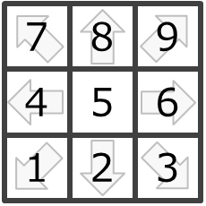

# DSL4GC（Domain Specific Language for Game Control）

In [GameControllerizer](../README.md), game control information is expressed in an abstract format DSL4GC(Domain-specific Language for Game Control）. DSL4GC is expressed as JSON format, and is easy to read & edit.
Appropriately changing this information and re-exporting it in Node-RED makes it possible to 
map it to inputs for games. 

## Example : StreetFighter2 "Hadouken (a.k.a Fireball)"
```
[
  {"dpad":[2], "btn":[], "ang":[0,0,0,0], "dur":2}
  {"dpad":[3], "btn":[], "ang":[0,0,0,0], "dur":2}  
  {"dpad":[6], "btn":[], "ang":[0,0,0,0], "dur":2}
  {"dpad":[5], "btn":[0], "ang":[0,0,0,0], "dur":2}
]
```

# Grammar

The operations of Gamepad/Mouse/Keyboard (= common game controllers) can be expressed in DSL4GC.

```
gc_sentence = Array[gc_word]

gc_word = gc_gamepad_word | gc_mouse_word | gc_keyboard_word

gc_gamepad_word = {“dpad”:Int, “btn”:Array[Int], ”ang“:Array[Int], “dur”:Int}
gc_mouse_word =  {“btn”:Array[Int], “mov”:Array[Int], “dur”:Int}
gc_keyboard_word = {“key”:Array[String], “mod”:Array[Int],  “dur”:Int}
```

## gc_gamepad_word (abstract Gamepad operation)
`{“dpad”:Int, “btn”:Array[Int], ”ang“:Array[Int], “dur”:Int}`

The abstract Gamepad has,

- 1-dpad
- n-buttons
- 2-analog_sticks

### dpad : `Int`
The dpad value represents a direction of the Dpad.



### btn : `Array[Int]`
The btn array contains IDs of pressed buttons.

### ang : `Array[Int]`
The ang array contains analog stick states as integers 
([Axis0-h, Axis0-v, Axis1-h, Axis1-v]，Range: -128..127).

### dur : `Int`
The dur value represents a duration of holding each operation for devices （dpad, btn, ang） for n-frames (1frame = 16.666ms).

- 0 - 127 :  The operation is hold for n-frames, then released.
- Smaller than 0  : The operation is hold continuously until a next operation is entered.

### Example
Press Button-0 for 2-frames.
```
{“dpad”:5, “btn”:[0], “ang”:[0,0,0,0], “dur”:2}
```

Hold down key of Dpad.
```
{“dpad”:2, “btn”:[], “ang”:[0,0,0,0], “dur”:-1}
```

### Tip
These two codes represent the same operation, and there are replacable.

#### Code-1
```
Enter > [{“dpad”:5, “btn”:[0], “ang”:[0,0,0,0], “dur”:2}]
```

#### Code-2
```
Enter > [{“dpad”:5, “btn”:[0], “ang”:[0,0,0,0], “dur”:-1}]
Wait  > 2-frame（=0.033 msec)
Enter > [{“dpad”:5, “btn”:[], “ang”:[0,0,0,0], “dur”:-1}]
```
 
## gc_mouse_word (abstract Mouse operation)
`{“btn”:Array[Int], “mov”:Array[Int], “dur”:Int}`

The abstract Mouse has,

- 3-buttons
- 2-axes

### btn : `Array[Int]`
The btn array contains IDs of pressed buttons.
- 0:Left button
- 1:Right button
- 2:Middle button

### mov : `Array[Int]`
The mov array contains relative mouse movements ([dX, dY]).

### dur : `Int`
Same as Gamepads's dur value.

### Example
Left click.
```
{“btn”:[0], “mov”:[0, 0], “dur”:2}
```

## gc_keyboard_word (abstract Keyboard operation)
`{“key”:Array[String], “mod”:Array[Int],  “dur”:Int}`

The abstract Keyboard has,
- Alphanumeric keys（”a”～”z”,”0”～”9”）
- Arrow pad keys（”ArrowUp”, “ArrowDown”, “ArrowRight”, “ArrowLeft”）
- Function keys（”F1”～”F12”, “Escape”）
- Functional keys （”Space”, “Tab”, “Enter”, “Backspace”）
- Modifierkey（”Ctrl”, “Shift”, “Alt”）

It is a subset of general keys, but enough for common game.
It is too hard to handle full keys because of the location. 

### key : `Array[String]`
The key array contains names of pressed keys (except Modifier keys).

### mod : `Array[Int]`
The mod array contains IDs of pressed modifier keys.
- 0:Control
- 1:Shift
- 2:Alt

### dur : `Int`
Same as Gamepads's dur value.

### Example

Type ”a”.
```
{“key”:[“a”], “mod”:[], “dur”:2}
```

Type “A”（=”Shift”+”a”）.
```
{“key”:[“a”], “mod”:[1], “dur”:2}
```
